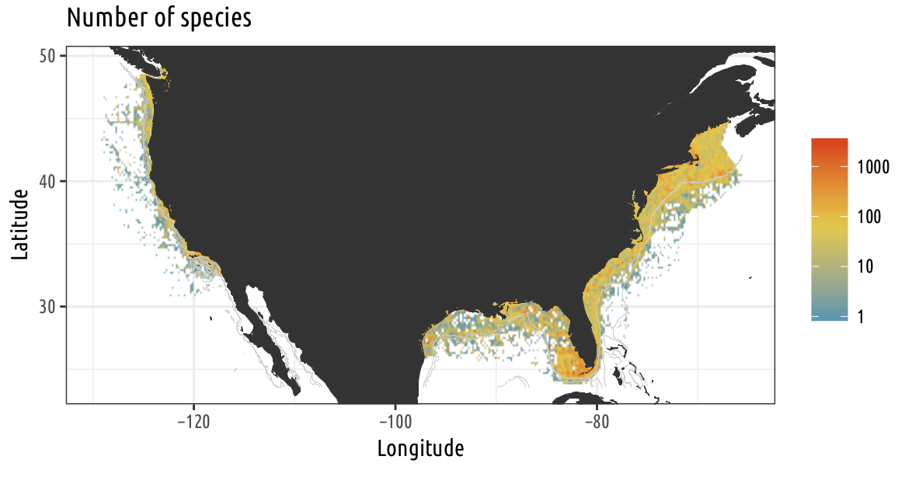

# Who am I?

### Evolutionary Biologist and Biodiversity Scientist

> Computational tools can help us identify knowledge gaps, refine our research
> questions, and improve our understanding of the natural world.

### Reproducible Research Enthusiast and Advocate

> Computational tools can help us make our science more robust.

### Experienced Instructor

> The next generation of scientists needs fluency in their understanding of
> computational tools.


---
# General coding principles

* Use version control
* Unit testing, continuous integration, code coverage
* Keep the end-user in mind
* Code review whenever possible


---
class: inverse, middle

## R packages

for phylogenetic data

---
# R package: `phylobase`

* Data structure for comparative methods
* Tree and associated data in a single object

```{r}
library(phylobase)
head(geospiza, n = 4)
```

---
# R package: `rncl`

* Wrapper around the NEXUS Class Library
* Robust parsing of NEXUS and Newick files

# R package: `cipresr`

* Send data and parameters to CIPRES Science Gateway for phylogenetic analysis

---
# R package: `rotl`

* Use the Open Tree of Life API
* Link with other R packages for phylogenetic data

```{r, echo=TRUE, cache=TRUE}
library(rotl)
taxa <- tnrs_match_names(names =
            c("Chlamydomonas reinhardtii",
              "Drosophila melanogaster", "Arabidopsis thaliana",
               "Rattus norvegicus", "Mus musculus",
               "Cavia porcellus", "Xenopus laevis",
               "Saccharomyces cervisae", "Danio rerio"))
tr <- tol_induced_subtree(ott_id(taxa))
```

---
# R package: `rotl`

```{r}
plot(tr)
```

---
class: inverse, middle, center

# A shiny app for planktonic larvae

---
# A shiny app for planktonic larvae

* organization of photo, collection events, and taxonomic information
* <http://plankton-atlas.net>


---
# A shiny app for planktonic larvae

* Docker image with R, shiny, and all other packages needed
* Hosted on Digital Ocean
* Fully deployed from within R

--

### In progress

* Pipeline and tools to improve taxonommic assignments from metabarcoding runs
  from plankton tows.

---
class: inverse, center, middle

# The State of Knowledge of Marine Invertebrate Biodiversity in the US

---

## What do we know about marine biodiversity in the US?

* Analyze 3+ million occurrence records from biodiversity databases
* First data synthesis on marine invertebrates at this scale
* Fully reproducible analysis (using `remake` package)



---

## What do we know about marine biodiversity in the US?

* Results from API calls are cached (using the `storr` package)
* Raw records are assembled into a PostgreSQL database
* Manuscript written in Rmarkdown
* Project avaialble at: https://github.com/fmichonneau/sok-marine-biodiversity/
* Skills:
  - data wrangling and cleaning
  - geospatial analysis
  - 

---
class: inverse, middle, center

# Computing training

---
# Programming for Biologists Using R

* Semester-long course for PhD students (and postdocs) in Biology (taught in
  Spring 2015)
* https://r-bio.github.io

--

# Data and Software Carpentry

* 14 workshops: USA, Caribbean, Europe
* Introductory computing skills to a broad audience
* Certified instructor and instructor trainer


---
class: inverse, middle, center

# Questions

