# Who am I?

### Evolutionary Biologist and Biodiversity Scientist

> Computational tools can help us identify knowledge gaps, refine our research
> questions, and improve our understanding of the natural world.

### Reproducible Research Enthusiast and Advocate

> Computational tools can help us make our science more robust.

### Experienced Instructor

> The next generation of scientists needs fluency in their understanding of
> computational tools.

---
class: inverse, middle

## 

#### > Establishing new baseline for marine biodiversity knowledge with modern technologies

<!-- we can speed up greatly how much we study and use technology to identify interesting problems -->

#### > How can we speed up the documentation of biodiversity?

<!-- many basic questions: how many species? where do species live? can we tell them apart? very difficult to answer -->

---

class: inverse, center, middle

# Species diversity and species limits in sea cucumbers

---

# Species limits

.pull-left[
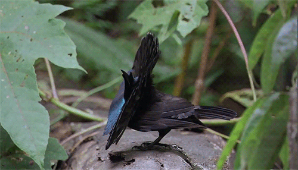
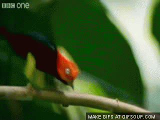
]

.pull-right[
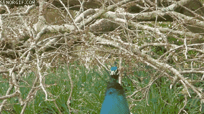
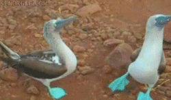
]

---
class: inverse
background-color: black

# Species limits

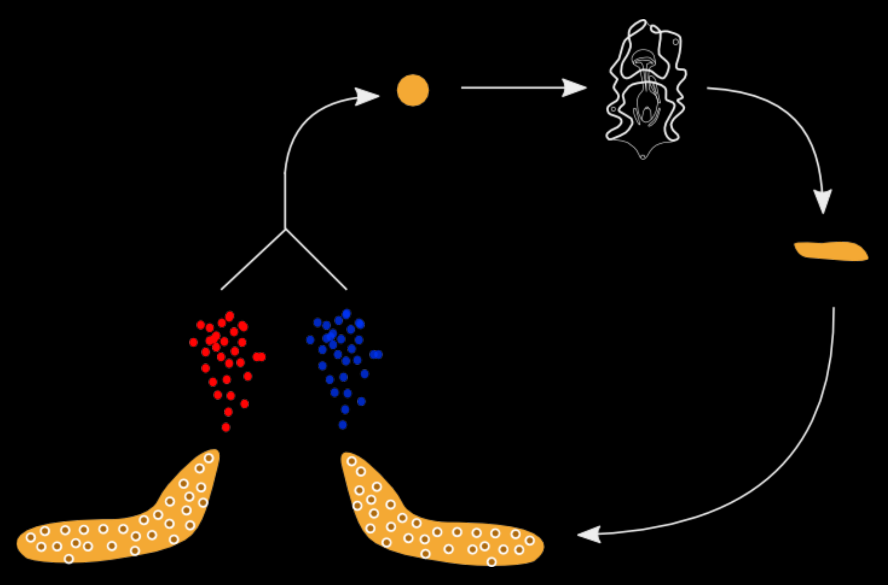

---

# Species limits

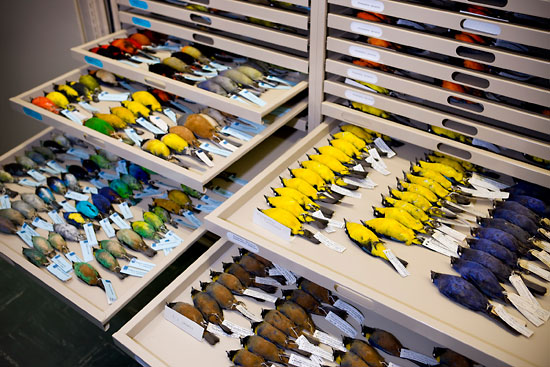

---

# Species limits

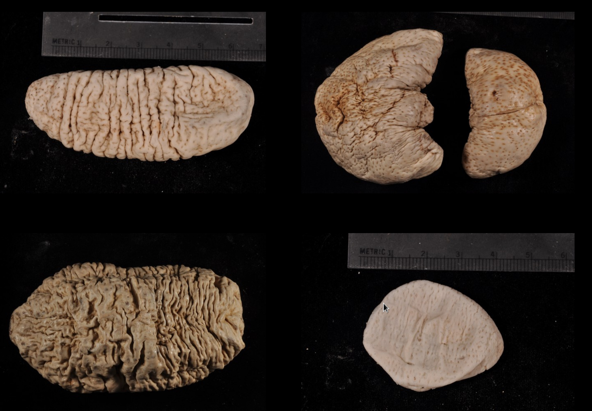

---
background-image: url(img/cuke_taxonomy.png)
background-size: cover

---
background-image: url(img/industry.png)
background-size: cover

---
background-image: url(img/industry2.png)
background-size: cover

---
background-image: url(img/map_sampling.png)
background-size: cover

---
background-image: url(img/summary_barcoding.png)
background-size: cover

---
background-image: url(img/impatiens1.png)
background-size: cover

---
background-image: url(img/impatiens2.png)
background-size: cover

---
class: inverse, center, middle

# Accelerating Biodiversity Documentation

---

## What do we know about marine biodiversity in the US?

* Analyze 3+ million occurrence records from biodiversity databases
* First data synthesis on marine invertebrates at this scale

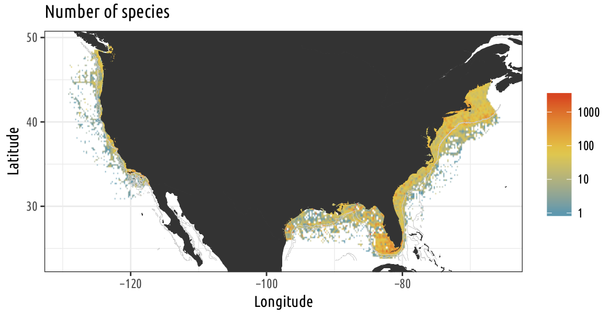

---

## Correlation between number of records and number of species

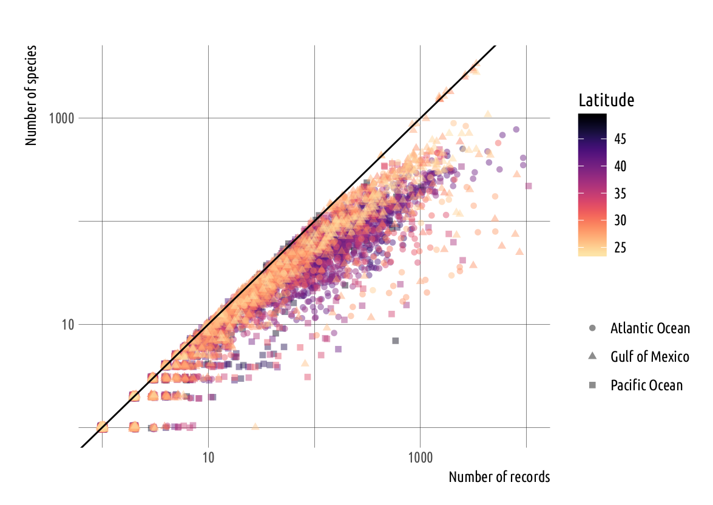

---

## Newly recorded species track number of samples collected

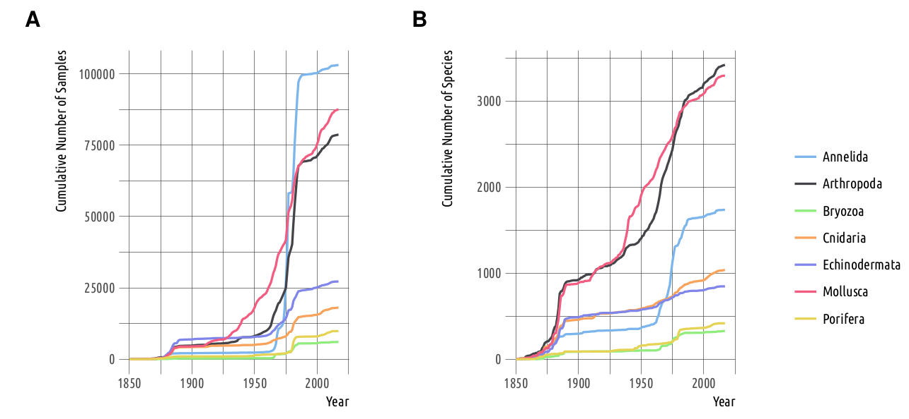

---

## Metabarcoding, a promising approach

.center[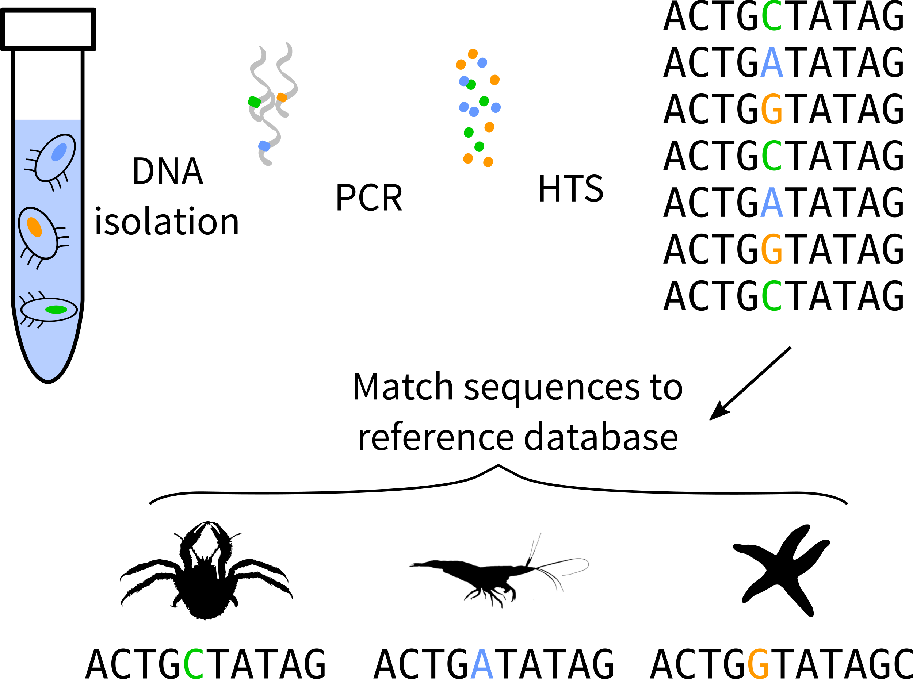]

---

## DNA barcoding

.center[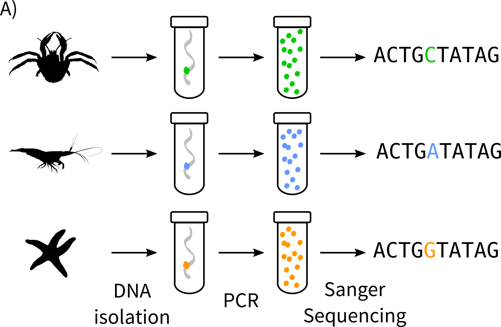]

---

## Metabarcoding

Target mtDNA COI (5 million DNA sequences available) but <20% of fauna barcoded

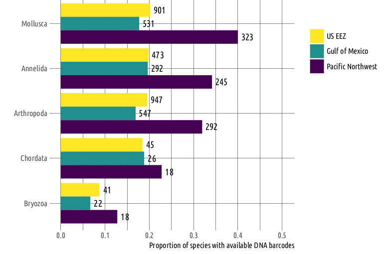

---

## How to identify species without a match in database?

### Develop new tools based on protein sequence

> increase accuracy of assignment

---
class: middle, center, inverse

# Questions

